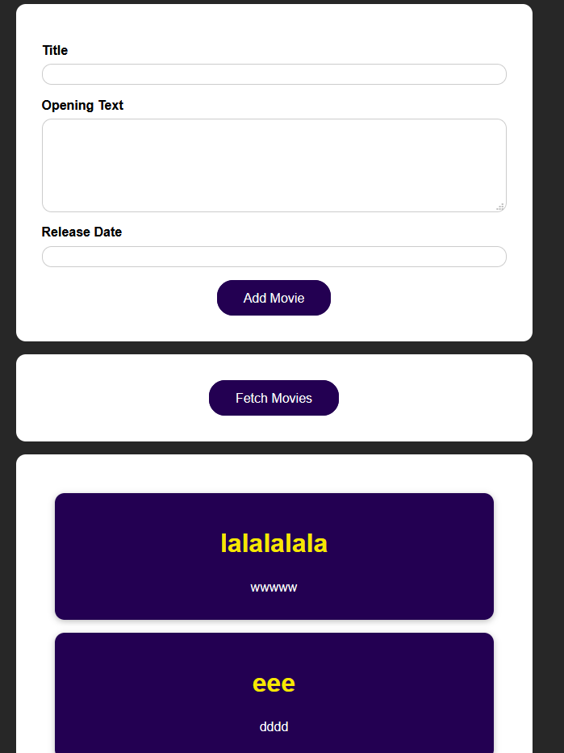

# react-webapp-8-firebase
*Section 14: Sending Http Requests (e.g. Connecting to a Database)*

- app for å legge til og liste databaseverdier
- kontakter database via firebase




```
npm install
npm start
```